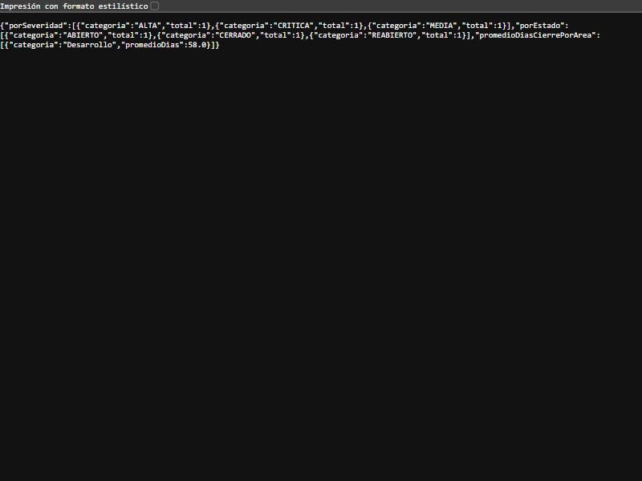
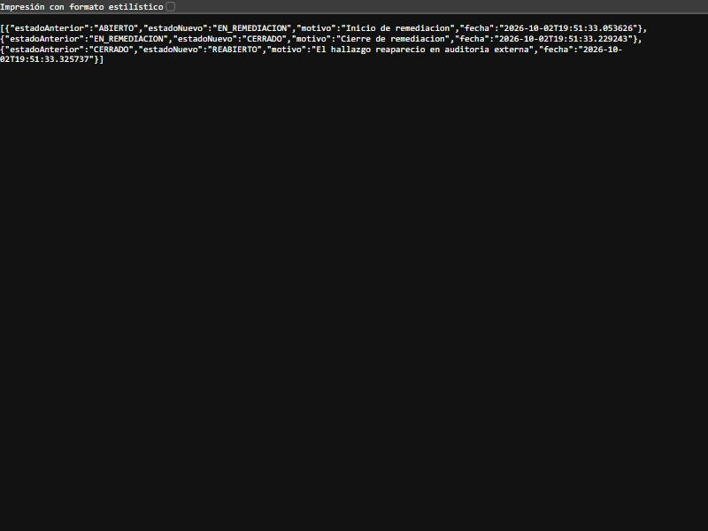

# Post-contenido — Unidad 8: Patrones Arquitectónicos II

## Descripción

Repositorio del post-contenido de la Unidad 8 de Patrones de Diseño
de Software — Sexto Semestre. Sistema de seguimiento de hallazgos
de auditoría interna implementado con **Clean Architecture** (Parte 1)
y extendido con un **dashboard agregado** y una **bitácora de
trazabilidad** (Parte 2), sobre el mismo proyecto Spring Boot, tras un
análisis costo-beneficio explícito de CQRS/Event Sourcing.

## Estructura de paquetes (los cuatro círculos)

```
sanchez-post1-u8/
├── pom.xml
└── src/main/java/com/example/auditoria/
    ├── domain/                     ← Entities (sin Spring ni JPA)
    │   ├── entity/HallazgoAuditoria.java        (Aggregate Root + maquina de estados)
    │   └── valueobject/            (HallazgoId, Severidad, EstadoHallazgo,
    │                                PlanRemediacion, TransicionInvalidaException)
    ├── usecase/                    ← Use Cases (sin Spring)
    │   ├── *UseCase.java           (interfaces de caso de uso)
    │   ├── HallazgoResponse.java   (modelo de salida)
    │   ├── port/                   (HallazgoRepositoryPort, HistorialAuditoriaPort,
    │   │                            ConteoCategoria, PromedioCategoria, *View)
    │   └── impl/                   (implementaciones como clases planas)
    ├── adapter/                    ← Interface Adapters (Spring)
    │   ├── in/web/                 (HallazgoController, GlobalExceptionHandler, dto/)
    │   └── out/persistence/        (HallazgoJpaEntity, *JpaRepository, *Adapter,
    │                                HistorialCambioEstado*)
    ├── config/AuditoriaConfiguration.java   ← Frameworks & Drivers (composition root)
    └── AuditoriaHallazgosApplication.java
```

**Regla de dependencia:** el código solo apunta hacia adentro. `domain/` y
`usecase/` no importan `org.springframework` ni `jakarta.persistence` (los casos
de uso son clases planas cableadas en `AuditoriaConfiguration`); solo
`adapter/` y `config/` conocen los frameworks.

## Parte 1 — Clean Architecture (Hallazgos de Auditoría)

- **Entities:** `HallazgoAuditoria` (Aggregate Root) controla su ciclo de vida
  con una máquina de estados (`EstadoHallazgo.puedeTransicionarA`): ABIERTO →
  EN_REMEDIACION → CERRADO → REABIERTO → EN_REMEDIACION. No tiene setters.
- **Use Cases:** `RegistrarHallazgo`, `IniciarRemediacion`, `CerrarHallazgo`,
  `ReabrirHallazgo`, `ConsultarHallazgo`, con el puerto `HallazgoRepositoryPort`.
- **Interface Adapters:** `HallazgoController` (HTTP → casos de uso) y
  `HallazgoRepositoryAdapter` (entidad JPA ↔ agregado de dominio).
- **Frameworks & Drivers:** Spring Boot + JPA + H2.

## Parte 2 — Análisis costo-beneficio de CQRS/Event Sourcing

Los dos requisitos (dashboard agregado y trazabilidad legal) son el tipo de
necesidad que suele usarse para justificar CQRS y Event Sourcing. Aplicando los
criterios de la Sección 7 de la guía a la escala real de este laboratorio:

- **Escala y carga.** Es un sistema académico con un único desarrollador y sin
  usuarios concurrentes reales. No existe una diferencia de escala entre lecturas
  y escrituras que justifique infraestructura separada. → No justifica CQRS.
- **Complejidad de las consultas.** Los conteos por severidad/estado y el
  promedio de días de cierre por área se resuelven con consultas JPQL `GROUP BY`
  y un `AVG` sobre el **mismo esquema** (interface projections de Spring Data).
  No requieren otra base de datos ni otro modelo de lectura. → No justifica un
  modelo de lectura separado.
- **Consistencia.** El comité consulta el dashboard antes de cada reunión
  mensual: es un reporte bajo demanda. Es aceptable —y esperable— que refleje el
  estado al momento de la consulta; no se necesita tiempo real ni consistencia
  eventual entre dos modelos. → No justifica la complejidad de sincronizar
  proyecciones.
- **Naturaleza de la trazabilidad exigida.** Cumplimiento necesita **mostrar**
  la secuencia cronológica de cambios de estado (quién, cuándo, de qué estado a
  cuál), no **reconstruir** el estado reproduciendo eventos uno por uno. Le basta
  una bitácora cronológica que coexista con el estado actual ya persistido. →
  No justifica Event Sourcing (no se necesita que los eventos sean la fuente de
  verdad del estado).
- **Señales de sobre-ingeniería (Sección 7.2).** No hay un experto de negocio
  dedicado al modelado de eventos, el "equipo" es una sola persona sin
  experiencia previa con Event Sourcing, y no hay proyecciones futuras
  desconocidas. El costo de dos modelos separados no es proporcional al problema.

**Conclusión:** CQRS y Event Sourcing completos **no se justifican** a esta
escala. Se implementa una extensión liviana sobre el mismo repositorio y el
mismo modelo de estado: proyecciones de lectura puntuales para el dashboard y
una bitácora de auditoría append-only (`HistorialCambioEstado`) que coexiste
con `HallazgoJpaEntity` como única fuente del estado actual.

## Cómo ejecutar

```
$ mvn clean package
$ mvn spring-boot:run
```

- API: http://localhost:8080/api/hallazgos
- Dashboard: http://localhost:8080/api/hallazgos/dashboard
- Consola H2: http://localhost:8080/h2-console

## Capturas de pantalla

**Dashboard consolidado** (`GET /api/hallazgos/dashboard`) — conteo por
severidad, por estado y promedio de días de cierre por área:



**Historial cronológico append-only** (`GET /api/hallazgos/{id}/historial`) de
un hallazgo que recorrió ABIERTO → EN_REMEDIACION → CERRADO → REABIERTO:



El transcript completo de los endpoints está en
[docs/evidencia-endpoints.md](docs/evidencia-endpoints.md).

## Decisiones de diseño

1. **`Severidad` (enum simple) vs. `EstadoHallazgo` (enum con comportamiento).**
   `EstadoHallazgo` encapsula una regla de negocio real —qué transiciones son
   válidas— y por eso implementa `puedeTransicionarA(...)` con su máquina de
   estados. `Severidad` es solo una clasificación: ninguna severidad es "más
   válida" que otra en un momento dado, no tiene reglas de transición, así que
   modelarla con comportamiento sería agregar complejidad sin invariante que
   proteger. El nivel de comportamiento de un Value Object se decide por si
   encapsula o no una regla propia.

2. **`PlanRemediacion` como Value Object embebido vs. agregado separado.**
   Un hallazgo nunca puede pasar a EN_REMEDIACION sin un plan válido ni cerrarse
   sin uno ya definido: esa invariante debe cumplirse **siempre dentro de la
   misma transacción**, sin ventanas de inconsistencia. Por el criterio de
   *límite de consistencia transaccional* (Bounded Contexts/Agregados, Sección
   3.3), `PlanRemediacion` se modela como Value Object embebido en
   `HallazgoAuditoria`, no como agregado independiente con su propio repositorio
   (que abriría una ventana de inconsistencia entre dos transacciones).

3. **CQRS/Event Sourcing completos vs. extensión liviana** (ver análisis
   arriba). Se eligió la extensión liviana —mismo repositorio, mismo modelo de
   estado— porque los cinco criterios de la Sección 7 concluyen que la escala del
   proyecto no justifica el costo de dos stacks separados.

4. **Bitácora simple (`HistorialCambioEstado`) vs. Event Store completo.**
   Un Event Store exigiría que `HallazgoAuditoria` dejara de persistir su estado
   actual y se reconstruyera por *replay* en cada lectura —un cambio de fondo
   sobre un agregado que ya funciona— sin que exista hoy necesidad de reproducir
   estados intermedios ni de alimentar proyecciones desconocidas. Por las señales
   de sobre-ingeniería de la Sección 7.2, se implementa una tabla de auditoría
   adicional **append-only** (solo se inserta; no hay método que actualice o
   elimine), escrita en la misma transacción que cada transición, que **coexiste
   con** y no reemplaza al estado actual de `HallazgoJpaEntity`.

## Herramientas utilizadas

- Java 17, Spring Boot 3.x, Spring Data JPA, H2
- Apache Maven, Postman/curl, Git, GitHub

## Conclusiones

El laboratorio mostró que Clean Architecture se sostiene en una sola regla —la
dependencia siempre apunta hacia adentro— y que mantener el dominio y los casos
de uso libres de frameworks obliga a decisiones concretas, como cablear los
casos de uso a mano en un composition root en vez de anotarlos con `@Service`.
La Parte 2 fue, sobre todo, un ejercicio de criterio: los dos requisitos
"sonaban" a CQRS y Event Sourcing, pero aplicar los criterios de escala,
complejidad, consistencia y señales de sobre-ingeniería mostró que una extensión
liviana resolvía el problema real con una fracción del costo. Lo que llevaría a
reconsiderar la decisión sería un cambio verificable de contexto: múltiples
sedes con alta concurrencia y una diferencia real de carga entre lecturas y
escrituras (CQRS), o una exigencia regulatoria de reconstruir estados históricos
intermedios y auditar la secuencia como fuente de verdad (Event Sourcing). La
lección central es que la sofisticación de un patrón no es un valor en sí mismo:
se adopta cuando el problema lo exige, y se documenta por qué todavía no lo hace.
